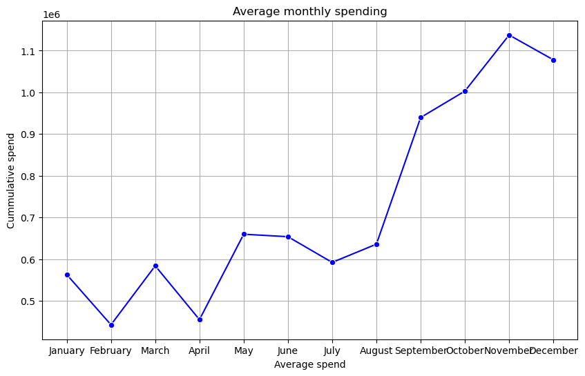
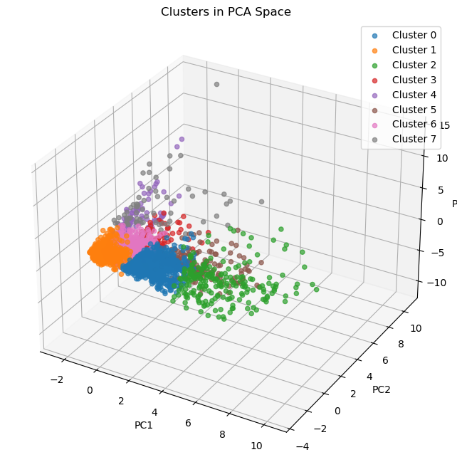
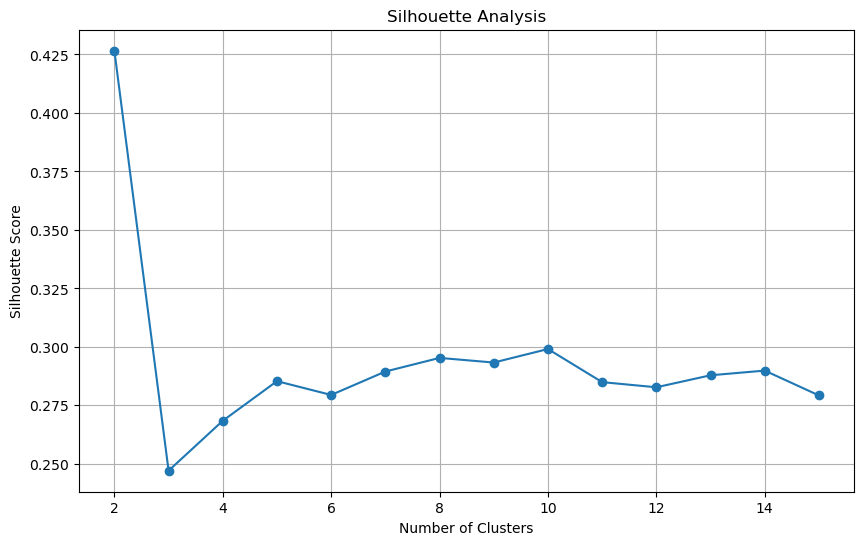

# **Customer Segmentation & Recommendation System**  

## **📌 Objective**  
This project aims to segment customers based on their **transaction behavior and spending patterns** using multiple **clustering algorithms**. By leveraging **machine learning and dimensionality reduction techniques**, the goal is to provide **data-driven insights** for personalized recommendations and targeted marketing strategies.  

---

## **📊 Workflow**  
### **1️⃣ Data Preprocessing & Feature Engineering**  
✔ Cleaned dataset by removing null values, duplicates, and anomalies.  
✔ Extracted **date-related features** (year, month, days since last purchase).  
✔ Created new columns: **Total transactions, total products purchased, and returned order quantity**.  
✔ **Performed RFM Analysis (Recency, Frequency, Monetary Value)** to understand customer behavior.  
✔ Standardized features for optimal clustering performance.  

### **2️⃣ Dimensionality Reduction (PCA)**  
✔ Applied **Principal Component Analysis (PCA)** to reduce feature dimensions.  
✔ Visualized **customer clusters in PCA space (2D & 3D)**.  

### **3️⃣ Clustering Algorithms Used**  
Implemented and compared **seven+ clustering algorithms** to identify the best segmentation model:  
✔ **K-Means Clustering**  
✔ **Agglomerative Hierarchical Clustering**  
✔ **DBSCAN (Density-Based Clustering)**  
✔ **Gaussian Mixture Models (GMM)**  
✔ **Mean-Shift Clustering**  
✔ **Spectral Clustering**  
✔ **Affinity Propagation**  
✔ **OPTICS (Ordering Points to Identify the Clustering Structure)**  

### **4️⃣ Cluster Evaluation & Optimization**  
✔ Used **Silhouette Score Analysis** to determine the optimal number of clusters.  
✔ Compared clustering results using **inertia, Davies-Bouldin Score, and visualization methods**.  

### **5️⃣ Business Insights & Recommendations**  
✔ Identified customer segments with **high purchasing power & frequent transactions**.  
✔ Recognized **low-value customers for targeted engagement campaigns**.  
✔ Built **customer personas** for **marketing personalization and retention strategies**.  

---

## **📂 Dataset Information**  
The dataset contains **customer transaction details**, including:  
- **Invoice Date & Customer ID**  
- **Total Transactions & Purchase Quantity**  
- **RFM Scores (Recency, Frequency, Monetary Value)**  
- **Returned Order Quantities & Cancellations**  

---

## **📊 Visualizations**  
### **1️⃣ Customer Segmentation in PCA Space (2D Projection)**  
Visualizing clusters after dimensionality reduction.  
  

### **2️⃣ Monthly Spending Trends**  
Average customer spending over time.  
  

### **3️⃣ Customer Clusters in PCA (3D Projection)**  
More detailed view of cluster separation.  
  

### **4️⃣ Optimal Number of Clusters (Silhouette Score Analysis)**  
Determining the best number of clusters.  
  

---

## **🔑 Key Insights & Findings**  
✔ **Customer groups are well-separated**, allowing for personalized marketing strategies.  
✔ **High-value customer clusters identified** for targeted retention programs.  
✔ **Seasonal spending trends** highlight key months for promotional campaigns.  
✔ **Multiple clustering models compared**, ensuring the most effective segmentation.  
✔ **RFM analysis helped categorize customers based on purchasing behavior.**  

---

## **🛠 Technologies & Tools Used**  
✔ **Python** – Pandas, NumPy, Scikit-Learn, Matplotlib, Seaborn  
✔ **Machine Learning** – PCA, K-Means, DBSCAN, Hierarchical Clustering, GMM, Spectral Clustering  
✔ **Feature Engineering** – RFM Analysis, Standardization  
✔ **Data Visualization** – Matplotlib, Seaborn  

---

## **🚀 Future Scope**  
🔹 Improve segmentation by **applying deep learning-based clustering**.  
🔹 Integrate **real-time customer segmentation dashboards** using Power BI or Tableau.  
🔹 Build a **recommendation engine based on segment behavior analysis**.  

---

### **🔗 GitHub Repository**  
🔗 **[View Full Project Here](https://github.com/your-github-username/customer-segmentation)**  

---

📩 **Let’s Connect!** If you’re interested in discussing **clustering, machine learning, or data-driven strategies**, feel free to reach out! 🚀  
